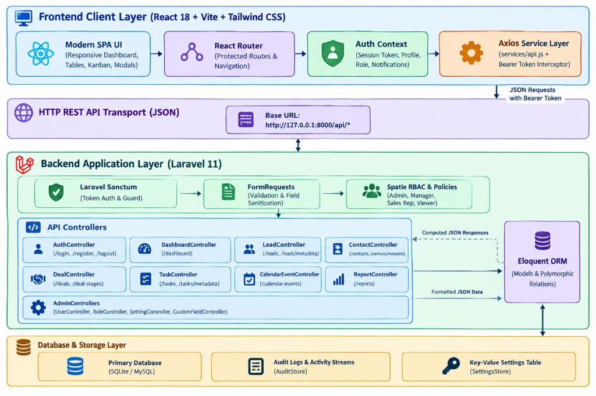
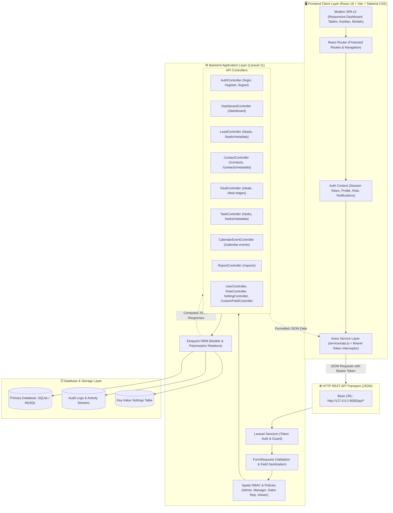
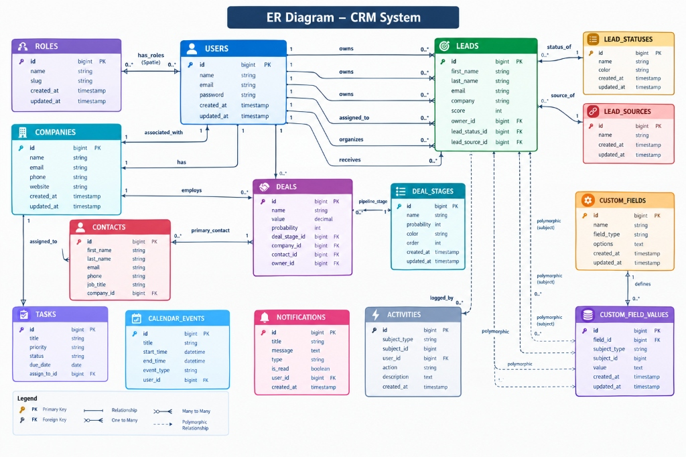
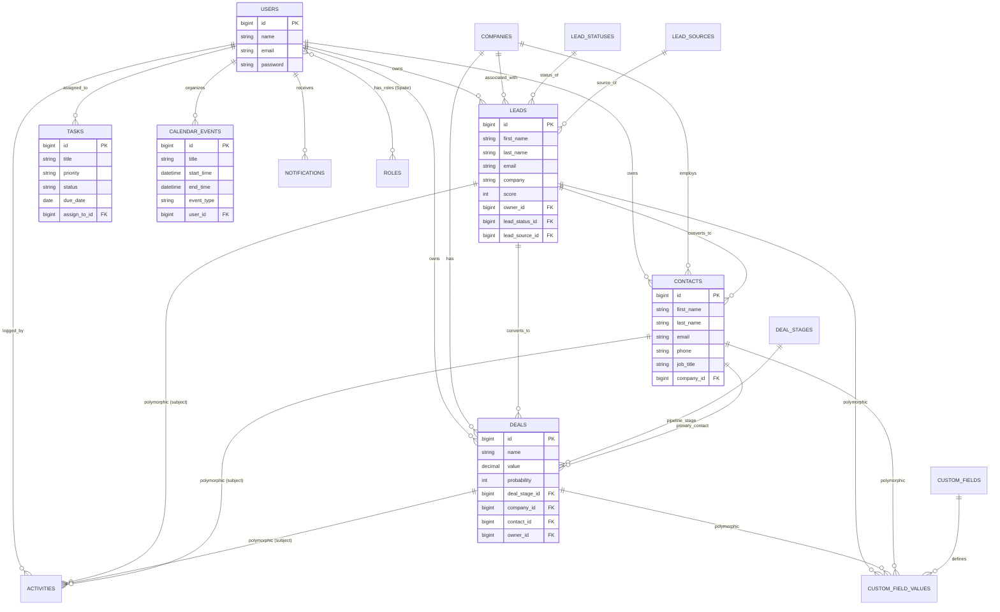
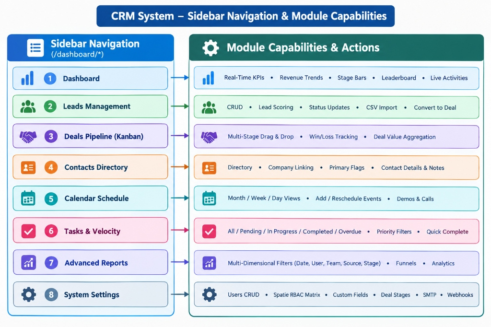
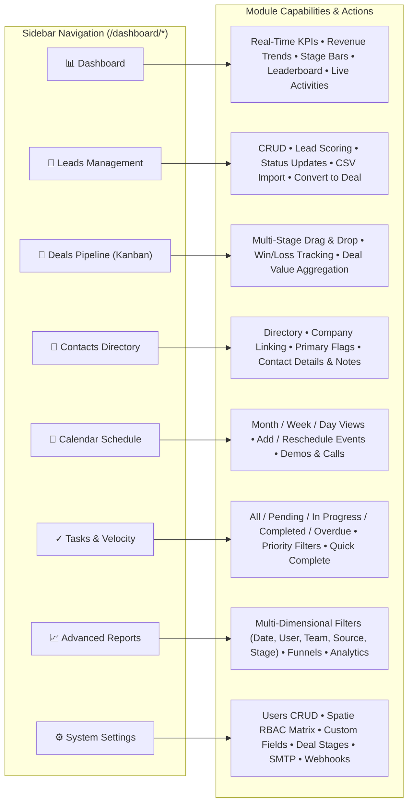
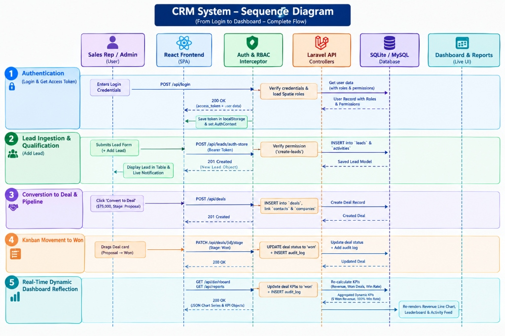
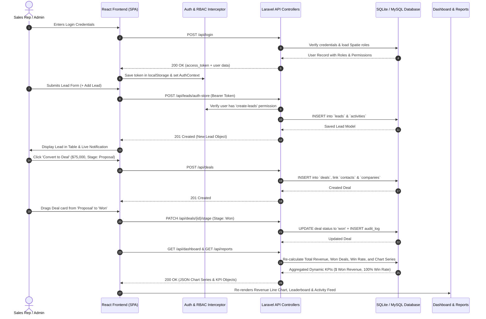

# SmartCRM - Enterprise Customer Relationship Management System

SmartCRM is a production-ready, full-stack Enterprise CRM and Sales Automation platform built with **Laravel 11/12** on the backend and **React 18 + Vite + Tailwind CSS** on the frontend. It features live database-driven analytics, Spatie Role-Based Access Control (RBAC), multi-stage Kanban deal pipelines, polymorphic custom fields, activity streams, calendar scheduling, and dynamic reporting.

---

## 📑 Table of Contents
1. [System Architecture Diagram](#1-system-architecture-diagram)
2. [Database Entity Relationship Diagram (ERD)](#2-database-entity-relationship-diagram-erd)
3. [Sidebar Navigation & Module Capabilities](#3-sidebar-navigation--module-capabilities)
4. [End-to-End Workflow Sequence Diagram](#4-end-to-end-workflow-sequence-diagram)
5. [Core Technology Stack](#5-core-technology-stack)
6. [Key Modules & Features](#6-key-modules--features)
7. [Installation & Setup](#7-installation--setup)
8. [API Endpoints Reference](#8-api-endpoints-reference)

---

## 1. System Architecture Diagram

This diagram describes the high-level 4-tier architecture of SmartCRM, illustrating the data flow from the React SPA client to the Laravel REST API backend, authorization layer, and relational database.



### Architecture Breakdown:
- **Frontend Client Layer (React 18 + Vite + Tailwind CSS)**: Modern single-page application (SPA) featuring responsive layouts, interactive Kanban boards, and Chart.js analytics. Managed with `React Router` and centralized `AuthContext` for session persistence.
- **Axios Service Layer (`services/api.js`)**: Centralized HTTP client configured with request/response interceptors to automatically attach Bearer tokens and handle 401 unauthorized redirects.
- **HTTP REST API Transport**: Secure JSON data exchange over RESTful API routes (`http://127.0.0.1:8000/api/*`).
- **Backend Application Layer (Laravel 11/12)**:
  - **Laravel Sanctum**: Token-based authentication and secure API guard.
  - **FormRequests**: Strict validation, field type casting, and sanitization.
  - **Spatie RBAC & Policies**: Database-backed permissions enforcing capabilities for Admin, Manager, Sales Representative, and Viewer roles.
  - **Eloquent ORM**: Object-relational mapping managing complex polymorphic associations (activities, custom fields, tasks, calendar events).
- **Database & Storage Layer**: Relational persistence for CRM entities, key-value settings store, and activity audit trails.



---

## 2. Database Entity Relationship Diagram (ERD)

This diagram details all database entities, attributes, primary/foreign keys, and polymorphic relationships across the system.



### Entity Relationships Summary:
- **Users & Spatie Roles**: Users have many-to-many roles and granular permissions. Users own Leads, Deals, Contacts, Tasks, and Calendar Events.
- **Companies & Accounts**: Central business entity linked one-to-many with Contacts, Leads, and Deals.
- **Leads & Deal Conversion**: Leads have Lead Statuses and Lead Sources. When qualified, leads convert into permanent Contacts and Deals.
- **Deals & Pipeline Stages**: Deals belong to dynamic Deal Stages (`order_index`, `probability`, `is_won`, `is_lost`) and connect to Companies and Contacts.
- **Polymorphic Activities & Custom Fields**: `activities`, `tasks`, `calendar_events`, and `custom_field_values` use polymorphic morph relations (`subject_type`, `subject_id`) to attach seamlessly to any CRM model.



---

## 3. Sidebar Navigation & Module Capabilities

This diagram outlines the 8 primary application modules accessible from the sidebar navigation and their specific capabilities.



### Module Breakdown:
1. **📊 Executive Dashboard (`/dashboard`)**: Live KPI metrics (Total Leads, Open Deals, Won Deals, Won Revenue, Win Rate, Pending Tasks), dynamic chart series, sales performance leaderboard, and real-time activity stream.
2. **👥 Leads Management (`/dashboard/leads`)**: Prospect acquisition, scoring algorithms, status tags, search/filter/sort, CSV bulk import, and 1-click deal conversion.
3. **🤝 Deals Pipeline (`/dashboard/deals`)**: Interactive Kanban board with drag-and-drop stage updates, revenue aggregation per stage, probability indicators, and won/loss management.
4. **📇 Contacts Directory (`/dashboard/contacts`)**: Complete customer directory with company associations, primary contact designations, communication history, and custom field values.
5. **📅 Calendar Schedule (`/dashboard/calendar`)**: Month, week, and day view scheduling for client demos, calls, meetings, and deadlines.
6. **✓ Tasks & Velocity (`/dashboard/tasks`)**: Task tracking categorized by All, Pending, In Progress, Completed, and Overdue, with priority filters and instant completion toggles.
7. **📈 Advanced Reports (`/dashboard/reports`)**: Multi-dimensional analytics filtered by date range, team member, role, lead source, and deal stage with conversion funnels.
8. **⚙️ System Settings (`/dashboard/settings`)**: Full administration panel for System Branding, Company Profile, Users CRUD, Spatie RBAC Permission Matrix, Pipeline Stages, Custom Fields, SMTP Mail, and Webhook Integrations.



---

## 4. End-to-End Workflow Sequence Diagram

This sequence diagram depicts the chronological interaction from user login to lead capture, deal conversion, Kanban movement to closed-won, and real-time dashboard analytics recalculation.





---

## 5. Core Technology Stack

- **Backend Framework**: PHP 8.2+, Laravel 11/12
- **Frontend SPA**: React 18, Vite 8, Tailwind CSS, Chart.js, React ChartJS 2
- **Authentication & Security**: Laravel Sanctum (Bearer Token), Spatie Laravel Permission (RBAC)
- **Database**: SQLite (Development) / MySQL 8.0+ / PostgreSQL (Production)
- **Testing & Quality Assurance**: PHPUnit Feature & Unit Test Suites (32 Suites / 339 Assertions)

---

## 6. Key Modules & Features

- **100% Database Persistence**: Zero hardcoded records or static mock data.
- **Strict Role-Based Access Control (RBAC)**:
  - **Admin**: Full unrestricted system access and configuration.
  - **Manager**: Full CRM management (Leads, Deals, Contacts, Tasks, Calendar, Pipelines, Custom Fields).
  - **Sales Representative**: Daily operations (View, create, edit records; cannot delete or modify system settings).
  - **Viewer**: Read-only access across CRM modules (modification requests blocked with `403 Forbidden`).
- **Polymorphic Activity Stream**: Unified timeline recording notes, calls, meetings, task completions, and deal stage changes.
- **Dynamic Kanban Engine**: Drag-and-drop deals across custom-defined stages with automatic probability calculation.
- **Custom Field Builder**: Add custom text, number, date, select, textarea, or boolean fields to Leads, Deals, Contacts, and Companies without changing database schemas.

---

## 7. Installation & Setup

### 1. Prerequisites
- PHP >= 8.2 with OpenSSL, PDO, Mbstring, Tokenizer, XML, and Ctype extensions.
- Composer >= 2.0
- Node.js >= 18.0 & NPM

### 2. Backend Setup
```bash
# Clone the repository
git clone https://github.com/your-org/smart-crm.git
cd smart-crm

# Install PHP dependencies
composer install

# Environment configuration
cp .env.example .env
php artisan key:generate

# Run database migrations and seeders
php artisan migrate:fresh --seed

# Start the Laravel development server
php artisan serve
```

### 3. Frontend Setup
```bash
# Navigate to the frontend directory
cd portal-frontend

# Install Node dependencies
npm install

# Start the Vite development server
npm run dev
```

### 4. Running Automated Tests
```bash
# Execute the full PHPUnit test suite
php artisan test
```

---

## 8. API Endpoints Reference

| HTTP Verb | Endpoint | Description | Auth Required |
| :--- | :--- | :--- | :--- |
| `POST` | `/api/login` | Authenticate user & receive bearer token | No |
| `POST` | `/api/register` | Register new user account | No |
| `POST` | `/api/leads` | Public lead capture endpoint | No |
| `GET` | `/api/user` | Fetch authenticated user profile & roles | Yes |
| `GET` | `/api/dashboard` | Fetch dynamic KPIs and chart series | Yes |
| `GET` | `/api/reports` | Multi-dimensional report metrics | Yes |
| `GET / POST` | `/api/leads` | List leads (paginated/filtered) / Auth create | Yes |
| `GET / PUT / DELETE` | `/api/leads/{id}` | Lead profile details / update / delete | Yes |
| `GET / POST` | `/api/deals` | List deals / Create opportunity | Yes |
| `PATCH` | `/api/deals/{id}/stage` | Update deal pipeline stage | Yes |
| `GET / POST` | `/api/contacts` | Contacts directory CRUD | Yes |
| `GET / POST` | `/api/tasks` | Tasks management CRUD | Yes |
| `GET / POST` | `/api/calendar-events` | Calendar events & scheduling | Yes |
| `GET / POST` | `/api/settings` | Retrieve / Persist system & email settings | Yes (Admin) |
| `GET / POST` | `/api/users` | Users management & role assignment | Yes (Admin) |
| `GET / POST` | `/api/roles` | Spatie roles & permissions management | Yes (Admin) |
| `GET / POST` | `/api/deal-stages` | Pipeline stages & win probabilities | Yes (Admin/Manager) |
| `GET / POST` | `/api/custom-fields` | Polymorphic custom fields builder | Yes (Admin/Manager) |

---

## 📄 License
This project is licensed under the MIT License - see the LICENSE file for details.
